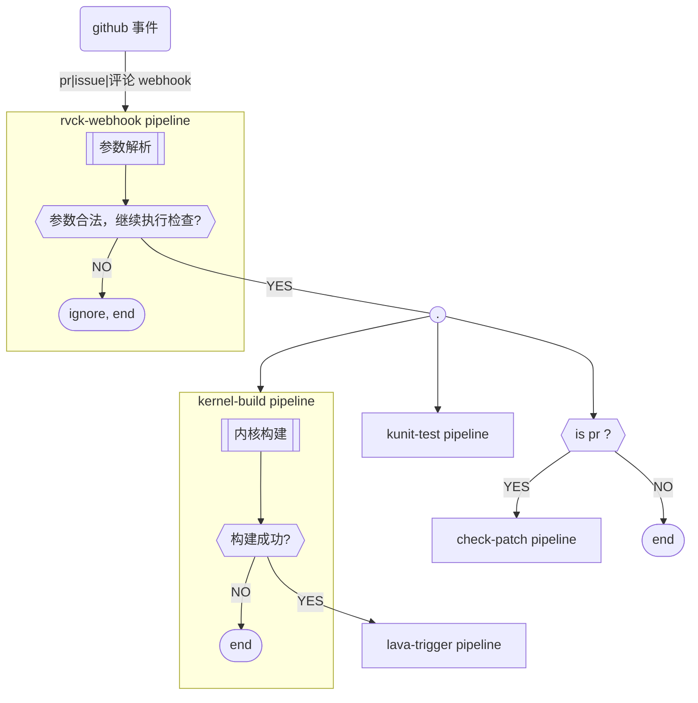

# RVCK

[RVCK-Project](https://github.com/RVCK-Project) 项目 **CI** 的**Jenkinsfile**

## 项目地址

|支持的Github仓库地址|
|---|
|https://github.com/RVCK-Project/rvck|
|https://github.com/RVCK-Project/rvck-olk|
|https://github.com/RVCK-Project/lavaci|


## 需求
|需求|完成状态|
|---|---|
|仓库的**PR**要自动触发**LAVA**内核测试，并回复结果至**PR**下|**done**|
|**/check**添加参数功能|**done**|
|仓库的**ISSUE**里要能触发**LAVA**内核测试，并回复结果至**ISSUE**里|**done**|
|**kunit-test, check-patch** 检查|**done**|


## 流程

- PR|issue|评论 -> webhook -> 触发流水线 -> 解析参数,确认参数是否合法,是否触发后续构建
- 每条检查流水线开始和结束时，通过 `gh` 更新对应标签
- 每条检查流水线结束时，通过 `gh` 更新结果和log链接到评论区



## Jenkins 搭建

### Jenkins plugin

- https://plugins.jenkins.io/generic-webhook-trigger
- https://plugins.jenkins.io/rebuild

### Jenkins agent

|架构|获取地址| 
|---|---|
|x86|hub.oepkgs.net/oerv-ci/jenkins-agent-lavacli-gh:latest|
|riscv64|hub.oepkgs.net/oerv-ci/jenkins-sshagent:latest|

**注意事项**：

- agent 初始化时需要配置`LC_ALL LANG`等环境变量。否则无法流水线无法正确加载utf-8编码文件，部分场景报错
- Docker Compose v1切换到Docker Compose v2 ,需使用 docker compose 启动：
        https://docs.docker.com/compose/install/linux/#install-the-plugin-manually

### Jenkins Credentials 凭证管理

> https://JENKINS_URL/manage/credentials/

|凭证id|用途说明|
|---|---|
|rvck_gh_token|gh 命令, 鉴权token, `gh ... --with-token` or `GH_TOKEN=${rvck_gh_token} gh ...`|

### 新建流水线

#### 初始化

- 新建item, 类型选择pipeline
- 配置流水线脚本来源为 `scm`
  - 配置`Jenkinsfile`从代码仓库拉取，配置`代码仓库  分支  脚本路径`
- 保存后，执行一次构建, `properties`会配置好流水线其他配置(`参数化构建 是否并行构建 触发方式` 等), 不需要手动修改配置。


#### 更新配置方式:

每个流水线脚本中都定义了 `properties`, 会配置流水线的 `参数化构建 是否并行构建 触发方式` 等配置。每次Jenkinsfile执行时, 都会按照properties重新设置流水线配置。

**因此不要在jenkins页面手动修改流水线配置。会在下次执行时被覆盖。需要通过Jenkinsfile中的 properties 配置流水线**

- 参考[流水线语法片段生成器](https://jenkins.oerv.ac.cn/pipeline-syntax/), 示例`properties`, 生成相关配置代码
- 在`Jenkinsfile`中修改 `properties` 并提交代码
- 执行一次空的构建 (所有参数为空, 或进配置页将参数化构建关闭,执行无参数构建)
- 执行后, 新的 `properties` 将生效，下次构建将用最新的参数化构建和配置

```groovy
// example: rvck-webhook 流水线配置
properties([
    disableConcurrentBuilds(), // 不允许并发构建
    parameters([ ... ]), // 参数化构建
    pipelineTriggers([ GenericTrigger(...) ]) // 配置 webhook 触发器，接收webhook请求
])
```

### jenkins job

#### rvck-webhook

- 接收webhook请求, 解析参数, 触发后续流水线
  - 解析 `PR` webhook, 直接触发构建
  - 识别并解析 `ISSUE`、 `ISSUE|PR comments`中的 `/check` 指令
- 重置所有标签为`waiting`状态


##### 流水线通过远程webhook触发, `Build with Parameters` 方式只用于更新token

- 流水线参数`WEBHOOK_TOKEN`, 在初始化流水线时，会用时间戳作为初始默认值。
- 参数值用于配置webhook触发插件: `GenericTrigger`, `token = ${WEBHOOK_TOKEN}`
- github 可通过webhook `http://JENKINS_URL/generic-webhook-trigger/invoke?token=${WEBHOOK_TOKEN}`, 触发当前流水线
- 更改token：
  - 点击构建, 参数`WEBHOOK_TOKEN`中输入新token
  - build之后，`GenericTrigger`插件和`WEBHOOK_TOKEN`默认值，都会改为新token

##### /check 参数解析

指令模板：`/check [key=value ...]`

|支持的key|描述|默认值|获取途径|
|:-:|:-:|:-:|:-:|
|lava_template|lava模板文件路径|lava-job-template/qemu/qemu-ltp.yaml|从[RAVA项目](https://github.com/RVCK-Project/lavaci)获取|
|testcase_url|lava测试用例路径|llava-testcases/common-test/ltp/ltp.yaml|从[RAVA项目](https://github.com/RVCK-Project/lavaci)获取|
|fetch|当前仓库的分支名或commit_sha,用于告知内核构建所需代码来源. ISSUE、ISSUE_COMMENT 必要参数。PR、PR_COMMENT 不读取此参数|issue必填参数|当前仓库的分支名，或commit_sha|
|测试变量|测试用例的参数|传递变量，并赋值为all即为测试全量，不传递变量即为测试默认值(模板里设置的默认值)|从[RAVA项目](https://github.com/RVCK-Project/lavaci) lava_template模板里actions.test.definitions.parameters下获取花括号里的变量名，比如${duration_hour}即为duration_hour、${ltp_testsuite}即为ltp_testsuite|


```bash
# Example:
/check lava_template='path/to/lava template.yaml' testcase_url=path/to/xxx.yaml 测试变量

# fio测试
/check lava_template=lava-job-template/qemu/qemu.yaml testcase_url=lava-testcases/performance-test/fio/fio.yaml

# sysbench测试
/check lava_template=lava-job-template/qemu/qemu.yaml testcase_url=lava-testcases/performance-test/sysbench/sysbench.yaml

# ltp默认参数测试
/check lava_template=lava-job-template/qemu/qemu-ltp.yaml testcase_url=lava-testcases/common-test/ltp/ltp.yaml 

# ltp指定math测试
/check lava_template=lava-job-template/qemu/qemu-ltp.yaml testcase_url=lava-testcases/common-test/ltp/ltp.yaml ltp_testsuite=math

# ltp全量测试
/check lava_template=lava-job-template/qemu/qemu-ltp.yaml testcase_url=lava-testcases/common-test/ltp/ltp.yaml ltp_testsuite=all

# ltp-stress默认参数测试
/check lava_template=lava-job-template/qemu/qemu-ltp-stress.yaml testcase_url=lava-testcases/common-test/ltp-stress/ltp-stress.yaml

# ltp-stress指定1小时测试
/check lava_template=lava-job-template/qemu/qemu-ltp-stress.yaml testcase_url=lava-testcases/common-test/ltp-stress/ltp-stress.yaml duration_hour=1

# issue下指定commitid执行默认测试
/check fetch=d370d4b6b1a340176d56ecf48459fcc7e899df1f

# issue下指定commitid执行fio测试
/check fetch=d370d4b6b1a340176d56ecf48459fcc7e899df1f lava_template=lava-job-template/qemu/qemu.yaml testcase_url=lava-testcases/performance-test/fio/fio.yaml
```

#### check-patch

- 只有 `PR|PR 评论` 会执行本流水线
- 获取`PR`目标分支和源分支, `git format-patch` 生成 patch
- 调用`scripts/checkpatch.pl`检查patch
- 触发 `gh_action`, `构建结果`展示到`PR|ISSUE`评论区 

#### kunit-test

- 拉取`PR`分支或`ISSUE`中`fetch=commit_sha`变量指定的commit节点
- 执行 `tools/testing/kunit/kunit.py`
- 触发 `gh_action`, `构建结果`展示到`PR|ISSUE`评论区

#### rvck-kernel-build

- 拉取`PR`分支或`ISSUE`中`fetch=commit_sha`变量指定的commit节点
- 执行内核构建
- 构建成功后发布内核至web服务器，可供下载
- 触发 `gh_action`, `构建结果`展示到`PR|ISSUE`评论区
- 触发 `rvck-lava-trigger`

#### rvck-lava-trigger

* 检查**testcase_url**、**lava_template**文件是否存在
* 对**lava_template**文件里的变量进行替换
* 触发**lava**测试
* 等待返回**lava**结果
* 触发 `gh_action`, `构建结果`展示到`PR|ISSUE`评论区

#### gh_actions

- 流水线负责执行 `gh` 相关命令
  - 添加标签
  - 删除标签
  - 增加评论
- 其余流水线在开始和结束时更新标签和将结果展示到评论区, 通过触发调用本流水线实现

## github 项目配置

### webhook 设置

- 配置webhook链接: `http://JENKINS_URL/generic-webhook-trigger/invoke?token=${WEBHOOK_TOKEN}`
  - WEBHOOK_TOKEN: `rvck-webhook` 中约定的token
- webhook events:
  - Issue comments
  - Issues
  - Pull requests

### labels 设置

参考 [通用配置 src/config.groovy](src/config.groovy) 中需要用到的`labels`，配置好issue和pr的labels类型。

## 服务/工具

|服务/工具|
|---|
|[Jenkins](https://www.jenkins.io/doc/)|
|[Kernelci](https://github.com/kernelci/dashboard)|
|[Lava](https://docs.lavasoftware.org/lava/index.html)|
|[gh](https://github.com/cli/cli#installation)|
|[lavacli](https://build.tarsier-infra.isrc.ac.cn/package/show/home:Suyun/lavacli)|
